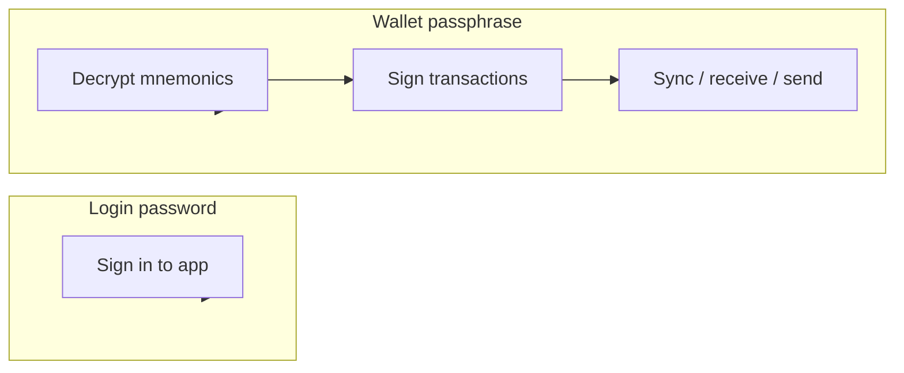

<div align="center">

# CoinWallet

<br />

`testnet-first` · `BIP84` · `BTC + XMR` · `desktop` · `non-custodial`

<br />

Cross-platform Bitcoin wallet for **Windows** and **Mac** — non-custodial, privacy-focused, with optional Monero (XMR), user-initiated BTC↔XMR swap, and on-device **Advisor AI** (no trading features).

<br />

**Download:** [coinwallet.pages.dev/download](https://coinwallet.pages.dev/download) · [GitHub Releases](https://github.com/akselbruun29-sys/CoinWallet/releases)

<br />

[Quick start](#quick-start) · [Download](#download-for-users) · [Security model](#security-model) · [App pages](#app-pages) · [AI context](#ai-context)

</div>

See **[.cursor/COINWALLET_MASTER_PLAN.md](./.cursor/COINWALLET_MASTER_PLAN.md)** for the full execution plan — it is the plan, loop state, and progress log in one file.

---

## At a glance

| | |
|---|---|
| **Wallets** | BIP84 native segwit (BTC) + Monero (XMR) — create, import, sync |
| **Spend** | Fee preview, PSBT signing, broadcast |
| **Swap** | User-initiated BTC↔XMR — quote, review, confirm (not a trading bot) |
| **Privacy** | Coin control, UTXO labels, privacy score |
| **Security** | Passphrase-encrypted mnemonics, auto-lock, optional DB sealing |
| **Leaderboard** | Opt-in public ranking — display name + balance only |
| **Distribution** | Direct downloads via [website](https://coinwallet.pages.dev) + [GitHub Releases](https://github.com/akselbruun29-sys/CoinWallet/releases) — no app stores |

```text
  ┌─────────────┐     unlock      ┌──────────────┐     Esplora     ┌──────────┐
  │  SvelteKit  │ ◄──────────────►│  FastAPI     │ ◄──────────────►│ testnet  │
  │  admin UI   │   wallet keys   │  sidecar     │   sync / send   │  chain   │
  └─────────────┘                 │ 127.0.0.1    │                 └──────────┘
         │                        └──────────────┘
         │         encrypted seeds       │
         └──────────────────────────────►│ SQLite (wallet.db)
```

---

## Download (for users)

| | |
|---|---|
| **Website** | https://coinwallet.pages.dev/download — OS detect, checksums, install guides |
| **GitHub Releases** | https://github.com/akselbruun29-sys/CoinWallet/releases — installers (Windows `.exe` hosted here when over Cloudflare size limit) |
| **Verify** | Compare SHA-256 on the download page before installing |

Windows **v0.1.0** is available. macOS builds are not published yet (`available: false` in `releases/releases.json`).

---

## Quick start (developers)

### 1 — Install

<table>
<tr>
<td width="50%">

**Windows**

```batch
setup.bat
```

</td>
<td width="50%">

**Mac / Linux**

```bash
chmod +x setup.sh
./setup.sh
```

</td>
</tr>
</table>

### 2 — Configure

Copy `.env.example` → `.env`, then set:

```env
WALLET_ENCRYPTION_KEY=<32+ char random secret>
ADMIN_USERNAME=admin
ADMIN_PASSWORD_HASH="<bcrypt hash>"
SESSION_SECRET=<random string>
BITCOIN_NETWORK=testnet
BITCOIN_BACKEND_URI=https://blockstream.info/testnet/api/
WALLET_DB=wallet.db
```

Generate a login password hash:

```powershell
python scripts/hash_password.py yourpassword
```

Or seed the admin user (dev only):

```powershell
python scripts/seed_admin.py
```

### 3 — Run

```powershell
.\start_admin.ps1
```

| Service | URL |
|---------|-----|
| **UI** | http://localhost:5173 |
| **API** | http://127.0.0.1:8002 |

Sign in as `admin` with the password matching `ADMIN_PASSWORD_HASH`.

Stop with `.\stop_admin.ps1` or close the service windows.

### Validate

```powershell
.\venv\Scripts\python.exe scripts\validate_isolation.py
```

Manual testnet steps: [`docs/TESTNET_CHECKLIST.md`](docs/TESTNET_CHECKLIST.md)

### 4 — First wallet

1. Sign in
2. Open **Security** → set your **wallet passphrase** (separate from login)
3. Unlock → **Wallets** → create or import
4. **Sync** → **Receive** / **Send**

> Your wallet passphrase encrypts recovery phrases. The server admin cannot decrypt them without it.

---

## Desktop release (Windows / macOS)

**Full step-by-step operator list:** [docs/YOU_MUST_DO.md](./docs/YOU_MUST_DO.md)

Operator checklist (security gate + toolchain, no build):

```powershell
.\scripts\operator-release-checklist.ps1
```

Build desktop installers after the security gate passes:

```powershell
.\scripts\build-windows.ps1
```

```bash
./scripts/build-mac.sh
```

Each build script runs `verify_release_security.py`, optional signing, updates `releases/releases.json`, and calls `finalize-release` to sync artifacts into `site/static/releases/` for deploy.

Pre-release checks (also run in CI):

```bash
python scripts/verify_release_security.py
```

**Optional signing env**

| Variable | Platform |
|----------|----------|
| `WIN_SIGN_CERT_PATH`, `WIN_SIGN_CERT_PASSWORD`, `SIGNTOOL_PATH` | Windows Authenticode |
| `APPLE_SIGNING_IDENTITY`, `APPLE_NOTARY_*` | macOS codesign + notarization |
| `RELEASE_SIGNER_FINGERPRINT` / `_WINDOWS` / `_MACOS` | Manifest publisher thumbprints |

**Publish site (Cloudflare Pages):**

```powershell
.\scripts\setup-cloudflare.ps1   # one-time wrangler login
.\scripts\deploy-site.ps1 -SkipVerify   # use -SkipVerify when Windows .exe is on GitHub only (>25 MiB)
```

Or after `npx wrangler login` in `site/`:

```powershell
$env:CLOUDFLARE_API_TOKEN = '<token>'   # optional if already logged in via wrangler
.\scripts\deploy-site.ps1 -SkipVerify
```

**Publish installer (GitHub Releases):**

```powershell
.\scripts\publish-github-release.ps1 -Version 0.1.0
```

Large Windows installers are hosted on GitHub Releases; `releases.json` points download buttons there. The marketing site stays on Cloudflare.

Or trigger GitHub Actions **Release desktop** with `mark_available` enabled (builds, updates manifest, deploys when Cloudflare secrets are configured). Pushing `releases.json` alone updates the manifest on CI but **not** gitignored binaries — run `deploy-site` after a local build.

Production sidecar template: [`.env.production.desktop.example`](.env.production.desktop.example). Set `STRICT_SECRETS`, `WALLET_DB_KEY`, and strong secrets before distributing. With `WALLET_DB_KEY`, the API seals `wallet.db` → `wallet.db.cwenc` on graceful shutdown.

---

## Docker

```bash
cp .env.example .env
# edit .env
docker compose up --build
```

Caddy reverse proxy on port 80. Set `SECURE_COOKIES=true` and `STRICT_SECRETS=true` for production.

### Database backup

```powershell
.\scripts\backup_db.ps1
```

```bash
./scripts/backup_db.sh
```

---

## Security model

Two passwords, two jobs:



| Layer | What it protects | Who knows it |
|-------|------------------|--------------|
| **Login password** | App access, sessions | You |
| **Wallet passphrase** | Encrypted mnemonics at rest | Only you |
| **Server pepper** | `WALLET_ENCRYPTION_KEY` in `.env` | Operator — not enough alone |
| **Unlock session** | In-memory signing keys (~15 min TTL) | This browser session |

**Defaults that matter**

- Registration off — admins approve new users
- Testnet first — mainnet gated behind explicit config
- Lock when done — unlock sessions expire automatically
- Login and wallet-unlock rate limiting

Never share your recovery phrase or wallet passphrase. You trust whoever runs the server — they could change code. Only use instances you trust.

### Session authentication (dual model)

Login establishes **two** session carriers. The API accepts either one via `get_any_authenticated_user` in `api/auth.py`:

| Mechanism | Storage | Used by | Notes |
|-----------|---------|---------|-------|
| **Bearer token** | `sessionStorage` key `wv_auth_token` | Desktop / Tauri SPA (primary) | Returned in `POST /api/auth/login` JSON; sent as `Authorization: Bearer …` on each request; cleared on logout or `401` |
| **HttpOnly cookie** | `wv_session` cookie | Browser-style flows | Set on login with `SameSite=Lax`; mutating cookie requests must pass Origin/Referer checks (`CsrfOriginMiddleware`) |

The admin client always sends `credentials: 'include'` and Bearer when a token exists. **Desktop builds rely on Bearer** because the embedded webview talks to the local sidecar on a different port than the static UI.

Session limits (configurable via `.env`):

- **Max age:** 7 days (`SESSION_MAX_AGE` in `api/auth.py`)
- **Idle timeout:** default 1 hour (`SESSION_IDLE_SECONDS`)
- **Rotation:** authenticated activity may return `X-Session-Token`; the client updates `sessionStorage`

WebSocket live updates (`/api/ws/events`) authenticate **after connect** with `{ "type": "auth", "token": "…" }` — the session token is never placed in the URL query string.

See `GET /api/auth/config` for `auth_primary`, `csrf_model`, and registration flags.

### Network privacy (desktop — Tor + light client)

Production desktop builds (**Option A — Wasabi-style network bootstrap**):

1. **Bundled Tor** starts with the app (`scripts/setup-tor.ps1` stages Tor Expert Bundle into the installer).
2. **SOCKS proxy** on `127.0.0.1:9050` — the API sidecar sets `HTTP_PROXY` / `TOR_ENABLED` automatically.
3. **Bitcoin sync** stays a **light client** (Esplora over Tor). No full blockchain download.
4. **First-run wizard** at `/setup` waits for Tor bootstrap, then continues to sign-in.

Leaderboard and optional cloud AI remain **separate clearnet** opt-in services — wallet keys and sync never use CoinWallet servers.

Toggle Tor for Bitcoin sync in **Settings → Network** (`tor_enabled` in system settings). Rebuild the installer after `scripts/setup-tor.ps1` to include Tor binaries.

---

## Using on your phone

On the same Wi‑Fi, open `http://<your-pc-ip>:5173`.

- Bottom nav: **Home · Wallets · Receive · Send · More**
- Tables scroll horizontally on small screens
- Forms and buttons stack for touch

---

## App pages

| Page | What it does |
|------|----------------|
| **Dashboard** | Balance, sync status, quick actions |
| **Wallets** | Create, import, select active wallet |
| **Receive** | BIP84 address + QR (BTC); subaddresses (XMR) |
| **Send** | Fee preview, broadcast |
| **Swap** | BTC↔XMR quote, review, history |
| **Coin Control** | Freeze UTXOs, add labels |
| **Transactions** | History after sync |
| **Privacy** | Privacy score, UTXO breakdown |
| **Advisor AI** | Rule-based tips — balance, fees, security, FAQ (no trading) |
| **Leaderboard** | Opt-in ranking by wallet balance |
| **Security** | Passphrase, lock/unlock, legacy migration |
| **Settings** | Account, password, network, leaderboard opt-in |
| **Admin** | Users, approval, audit *(admin only)* |
| **Logs** | Server logs *(admin only)* |

---

## Troubleshooting

<details>
<summary><strong>Can't log in</strong></summary>

- Verify hash: `python scripts/hash_password.py yourpassword` matches `ADMIN_PASSWORD_HASH` in `.env`
- Health check: `GET http://127.0.0.1:8002/api/health` → `{"status":"ok"}`
- Hard-refresh or clear session storage if an old token is stuck

</details>

<details>
<summary><strong>Port already in use</strong></summary>

```powershell
.\stop_admin.ps1
```

Then start again.

</details>

---

## AI context

> Everything below is for AI assistants and developers working on this repo.  
> Prefer minimal, focused diffs. Do not commit unless asked. Do not run tests unless asked.

### Project identity

**CoinWallet** — cross-platform non-custodial Bitcoin + Monero wallet (testnet first). Not a trading bot — repo folder name is legacy.

**Public links:** [Download site](https://coinwallet.pages.dev) · [GitHub Releases](https://github.com/akselbruun29-sys/CoinWallet/releases) · Repo `akselbruun29-sys/CoinWallet`

### Architecture

```
CoinWallet/
├── api/              # FastAPI — local sidecar + optional cloud_app (leaderboard)
├── admin/            # SvelteKit 5 wallet UI (Tauri webview)
├── site/             # Public download website (Cloudflare Pages)
├── src-tauri/        # Tauri 2 desktop shell
├── src/wallet/       # BTC engine, XMR, swap, privacy
├── releases/         # releases.json manifest (+ gitignored binaries)
├── cloud/            # Cloudflare Workers / D1 (leaderboard)
├── scripts/          # build, deploy, verify, release
└── docs/             # TESTNET_CHECKLIST.md
```

**Ports:** API `8002` (desktop + dev), UI dev server `5173` · Start: `.\start_admin.ps1` or Tauri app

**Stack:** Python / FastAPI / SQLite · SvelteKit 5 · embit + Esplora · Tauri (desktop)

### Safety rules (non-negotiable)

- Default to **testnet** (`BITCOIN_NETWORK=testnet`)
- Never expose `encrypted_seed`, mnemonics, or passphrases in GET responses or audit logs
- Gate mainnet behind explicit config (`ALLOW_MAINNET`, admin settings)
- Never commit `.env`, `wallet.db`, `trading_bot.db`, or key material
- Wallet routes scoped by `user_id` — admins must not access other users' wallets via API
- Audit sensitive actions (`WALLET_CREATED`, `TX_SENT`) without secrets

### Development guidelines

- Use **Esplora** for chain data; Bitcoin Core RPC optional
- Encrypt seeds at rest with `WALLET_ENCRYPTION_KEY` (server pepper) + per-user passphrase (v2)
- Signing requires unlocked wallet session (`WALLET_UNLOCK_TTL`, default 900s)
- UI: match existing shadcn-svelte patterns; mobile layout uses `MobileNav`, `ScrollTable`, responsive header
- Keep changes minimal — no drive-by refactors or extra abstractions
- Comments only for non-obvious business logic
- Match repo conventions for naming, imports, and file layout

### Key env vars

| Variable | Purpose |
|----------|---------|
| `WALLET_ENCRYPTION_KEY` | Server pepper for vault crypto |
| `ADMIN_PASSWORD_HASH` | Bcrypt login hash (quote in `.env`) |
| `SESSION_SECRET` | Session cookie signing |
| `WALLET_DB` | SQLite path (default `wallet.db`) |
| `OPEN_REGISTRATION` | Public signup (default `false`) |
| `AUTO_APPROVE_USERS` | Skip pending role (default `true`) |
| `BITCOIN_BACKEND_URI` | Esplora base URL |
| `WALLET_UNLOCK_TTL` | Unlock session seconds |
| `STRICT_SECRETS` | Fail startup on weak secrets (production) |
| `WALLET_DB_KEY` | Seal `wallet.db` as `wallet.db.cwenc` on API shutdown |
| `SECURE_COOKIES` | HTTPS-only cookies (production) |
| `COINWALLET_REMOTE_SERVICES_URL` | Opt-in leaderboard sync to cloud (display name + balance only) |

### Phase status

| Phase | Scope | Status |
|-------|-------|--------|
| **1–2** | Auth, wallet core | ✓ |
| **3–5** | Download site + Tauri desktop | ✓ |
| **4** | Leaderboard | ✓ |
| **6** | ~~Mobile apps~~ | **out of scope** |
| **7–8** | Privacy + Advisor AI | ✓ |
| **9** | Web release polish | ✓ |
| **10** | BTC + XMR + swap | ✓ |
| **11** | Security hardening | ✓ |
| **12** | Release readiness | ✓ |
| **13** | Local-first / cloud leaderboard | ✓ |
| **14** | Code review remediation | in progress (14.9+) |
| **15** | Download site visual upgrade | ~done (Lighthouse audit open) |

Full details in [`.cursor/COINWALLET_MASTER_PLAN.md`](.cursor/COINWALLET_MASTER_PLAN.md).

### Cursor rules

- `.cursor/rules/wallet-vault.mdc` — architecture and safety rules
- `.cursor/rules/read-master-plan-first.mdc` — read master plan (plan + loop)

### Repository name

The git folder may still be named `trading-bot`; the product is **CoinWallet**.
