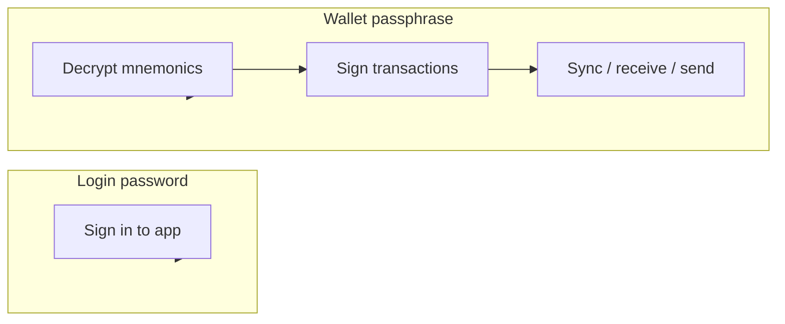

<div align="center">

# Wallet Vault

**Self-hosted, multi-user Bitcoin wallet** — Open WebUI-style admin shell with Wasabi-inspired privacy UX.

<br />

`testnet-first` · `BIP84` · `per-user encryption` · `mobile-ready`

<br />

[Quick start](#quick-start) · [Security model](#security-model) · [App pages](#app-pages) · [AI context](#ai-context)

</div>

---

## At a glance

| | |
|---|---|
| **Wallets** | BIP84 native segwit — create, import, sync via Esplora |
| **Spend** | Fee preview, PSBT signing, broadcast |
| **Privacy** | Coin control, UTXO labels, privacy score |
| **Security** | Your passphrase encrypts mnemonics — admins can't spend your coins |
| **Multi-user** | Per-user isolation, admin approval, audit log |
| **Mobile** | Bottom nav, touch targets, responsive tables |

```text
  ┌─────────────┐     unlock      ┌──────────────┐     Esplora     ┌──────────┐
  │  SvelteKit  │ ◄──────────────►│  FastAPI     │ ◄──────────────►│ testnet  │
  │  UI :5173   │   wallet keys   │  API :8001   │   sync / send   │  chain   │
  └─────────────┘                 └──────────────┘                 └──────────┘
         │                               │
         │         encrypted seeds       │
         └──────────────────────────────►│ SQLite (wallet.db)
```

---

## Quick start

### 1 — Install

<table>
<tr>
<td width="50%">

**Windows**

```batch
setup.bat
```

</td>
<td width="50%">

**Mac / Linux**

```bash
chmod +x setup.sh
./setup.sh
```

</td>
</tr>
</table>

### 2 — Configure

Copy `.env.example` → `.env`, then set:

```env
WALLET_ENCRYPTION_KEY=<32+ char random secret>
ADMIN_USERNAME=admin
ADMIN_PASSWORD_HASH="<bcrypt hash>"
SESSION_SECRET=<random string>
BITCOIN_NETWORK=testnet
BITCOIN_BACKEND_URI=https://blockstream.info/testnet/api/
WALLET_DB=wallet.db
```

Generate a login password hash:

```powershell
python scripts/hash_password.py yourpassword
```

Or seed the admin user (dev only):

```powershell
python scripts/seed_admin.py
```

### 3 — Run

```powershell
.\start_admin.ps1
```

| Service | URL |
|---------|-----|
| **UI** | http://localhost:5173 |
| **API** | http://127.0.0.1:8001 |

Sign in as `admin` with the password matching `ADMIN_PASSWORD_HASH`.

Stop with `.\stop_admin.ps1` or close the service windows.

### 4 — First wallet

1. Sign in
2. Open **Security** → set your **wallet passphrase** (separate from login)
3. Unlock → **Wallets** → create or import
4. **Sync** → **Receive** / **Send**

> Your wallet passphrase encrypts recovery phrases. The server admin cannot decrypt them without it.

---

## Security model

Two passwords, two jobs:



| Layer | What it protects | Who knows it |
|-------|------------------|--------------|
| **Login password** | App access, sessions | You |
| **Wallet passphrase** | Encrypted mnemonics at rest | Only you |
| **Server pepper** | `WALLET_ENCRYPTION_KEY` in `.env` | Operator — not enough alone |
| **Unlock session** | In-memory signing keys (~15 min TTL) | This browser session |

**Defaults that matter**

- Registration off — admins approve new users
- Testnet first — mainnet gated behind explicit config
- Lock when done — unlock sessions expire automatically

Never share your recovery phrase or wallet passphrase. You trust whoever runs the server — they could change code. Only use instances you trust.

---

## Using on your phone

On the same Wi‑Fi, open `http://<your-pc-ip>:5173`.

- Bottom nav: **Home · Wallets · Receive · Send · More**
- Tables scroll horizontally on small screens
- Forms and buttons stack for touch

---

## App pages

| Page | What it does |
|------|----------------|
| **Dashboard** | Balance, sync status, quick actions |
| **Wallets** | Create, import, select active wallet |
| **Receive** | Fresh BIP84 address + QR |
| **Send** | Fee preview, broadcast |
| **Coin Control** | Freeze UTXOs, add labels |
| **Transactions** | History after sync |
| **Privacy** | Privacy score, UTXO breakdown |
| **Stats** | Wallet aggregates |
| **Security** | Passphrase, lock/unlock, legacy migration |
| **Settings** | Account, password, network (admin) |
| **Admin** | Users, approval, audit *(admin only)* |
| **Logs** | Server logs *(admin only)* |

---

## Troubleshooting

<details>
<summary><strong>Can't log in</strong></summary>

- Verify hash: `python scripts/hash_password.py yourpassword` matches `ADMIN_PASSWORD_HASH` in `.env`
- Health check: `GET http://127.0.0.1:8001/api/health` → `{"status":"ok"}`
- Hard-refresh or clear session storage if an old token is stuck

</details>

<details>
<summary><strong>Port already in use</strong></summary>

```powershell
.\stop_admin.ps1
```

Then start again.

</details>

---

## AI context

> Everything below is for AI assistants and developers working on this repo.  
> Prefer minimal, focused diffs. Do not commit unless asked. Do not run tests unless asked.

### Project identity

Self-hosted **multi-user Bitcoin wallet** (testnet first). Not a trading bot — repo folder name is legacy.

### Architecture

```
trading-bot/
├── api/
│   ├── main.py       # FastAPI app, auth, status, CORS
│   ├── wallet.py     # Wallet CRUD, sync, send, UTXOs, privacy
│   ├── security.py   # Per-user wallet passphrase, lock/unlock, v1→v2 migration
│   ├── admin.py      # Users, settings, audit
│   └── events.py     # WebSocket hub (/api/ws)
├── admin/            # SvelteKit 5 + Tailwind 4 + shadcn-svelte
├── src/
│   ├── database.py   # SQLite: users, wallets, UTXOs, txs, audit
│   └── wallet/       # BIP84 keys, Esplora backend, embit PSBT engine
└── scripts/          # hash_password, seed_admin, test_login
```

**Ports:** API `8001`, UI dev server `5173` · Start: `.\start_admin.ps1`

**Stack:** Python / FastAPI / SQLite · SvelteKit 5 · embit + Esplora (Blockstream testnet API)

### Safety rules (non-negotiable)

- Default to **testnet** (`BITCOIN_NETWORK=testnet`)
- Never expose `encrypted_seed`, mnemonics, or passphrases in GET responses or audit logs
- Gate mainnet behind explicit config (`ALLOW_MAINNET`, admin settings)
- Never commit `.env`, `wallet.db`, `trading_bot.db`, or key material
- Wallet routes scoped by `user_id` — admins must not access other users' wallets via API
- Audit sensitive actions (`WALLET_CREATED`, `TX_SENT`) without secrets

### Development guidelines

- Use **Esplora** for chain data; Bitcoin Core RPC is Phase 4
- Encrypt seeds at rest with `WALLET_ENCRYPTION_KEY` (server pepper) + per-user passphrase (v2)
- Signing requires unlocked wallet session (`WALLET_UNLOCK_TTL`, default 900s)
- UI: match existing shadcn-svelte patterns; mobile layout uses `MobileNav`, `ScrollTable`, responsive header
- Keep changes minimal — no drive-by refactors or extra abstractions
- Comments only for non-obvious business logic
- Match repo conventions for naming, imports, and file layout

### Key env vars

| Variable | Purpose |
|----------|---------|
| `WALLET_ENCRYPTION_KEY` | Server pepper for vault crypto |
| `ADMIN_PASSWORD_HASH` | Bcrypt login hash (quote in `.env`) |
| `SESSION_SECRET` | Session cookie signing |
| `WALLET_DB` | SQLite path (default `wallet.db`) |
| `OPEN_REGISTRATION` | Public signup (default `false`) |
| `AUTO_APPROVE_USERS` | Skip pending role (default `true`) |
| `BITCOIN_BACKEND_URI` | Esplora base URL |
| `WALLET_UNLOCK_TTL` | Unlock session seconds |

### Phase status

| Phase | Scope | Status |
|-------|-------|--------|
| **1** | Auth, schema, UI shell | ✓ |
| **2** | Keys, Esplora sync, send/receive | ✓ |
| **3** | Coin control, privacy score, labels | in progress |
| **4** | WebSocket live sync ✓ · Core RPC · node integration | planned |

### Cursor rule

Project rule file: `.cursor/rules/wallet-vault.mdc` — keep in sync when architecture or safety rules change.
